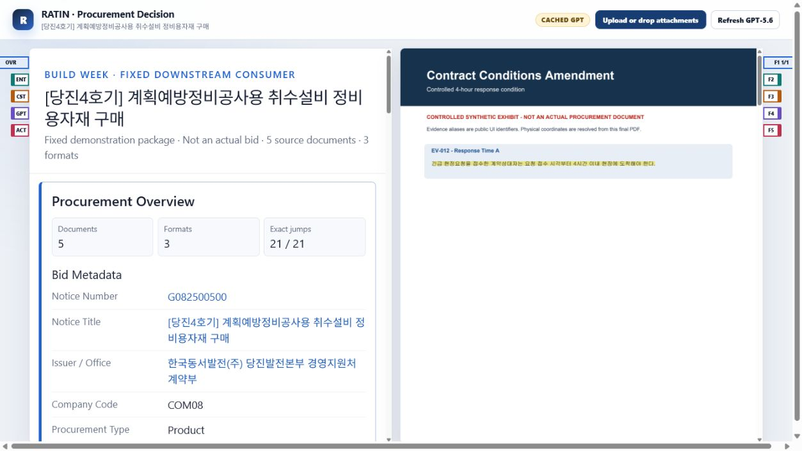

# RATIN - Evidence-Linked Procurement Decision Intelligence

RATIN turns a mixed-format procurement package into an English decision brief
whose facts, conflicts, and actions link back to the exact source sentence or
worksheet cell in a continuous Evidence PDF stream.

This repository contains the Build Week downstream consumer. The proprietary
canonical document-processing engine is not included. The included artifacts
were generated by the proprietary engine and sanitized for public evaluation.
The demo remains fully runnable using frozen evidence artifacts and a validated
cached GPT-5.6 response. Live GPT-5.6 execution is optional and requires the
evaluator's own API key.

> Synthetic demonstration only. This is not an actual bid, contract cost,
> expected profit, eligibility decision, or final procurement decision.

## What it does

Procurement facts are often split across notices, conditions, spreadsheets, and
summary documents. RATIN presents the decision impact on the left and the full
source stream on the right. Selecting a linked fact scrolls to the correct
document and page and highlights the exact text or cells used for the judgment.

The fixed public demonstration includes deliberate conflicts in emergency
response time, delivery term, and quantity unit. It also separates document
Evidence from external public-price provenance and fails closed when an exact
document item match does not exist.

## Demo highlights

All values below are read from the frozen public packet and manifests.

- 5 source-document roles across 3 original formats
- 21 exact Evidence links and 26 physical text/cell targets
- 0 page, document, table, nearest, offset, or first-page fallbacks
- Continuous Evidence stream with active file/page bookmarks
- Same-page multi-target highlighting for six worksheet rows
- Three exact A/B conflict comparisons
- GPT-5.6 strict structured analysis with Evidence-ID and allowed-number gates
- Public API provenance drawer with total and applied sample counts separated
- Cached mode that requires no API key
- Simultaneous five-file drag/drop or folder selection for the fixed package



## Problem

A procurement condition can appear in one document, be corrected in another,
and be summarized differently in a spreadsheet or presentation. Manual review
must detect real conflicts, semantic restatements, missing obligations, unit
differences, and unpriced scope without losing the source location. A page-level
link is often too broad; a reviewer needs the exact sentence or cell.

## How it works

```text
Public or controlled synthetic documents
    -> proprietary canonical pipeline (not included)
    -> verified and sanitized Evidence packet
    -> GPT-5.6 structured reasoning
    -> Dual A4 decision brief
    -> exact source navigation
```

The public app does not contain source parsing, normalization, Evidence
generation, or coordinate-binding internals. It verifies public file digests,
reads public aliases and coordinates from a sanitized binding manifest, validates
the GPT response, and renders the consumer.

## Deterministic engine vs GPT-5.6

Deterministic/frozen responsibilities:

- Parsing and source normalization
- Evidence PDF generation
- Page and bbox binding
- Arithmetic and cost coverage
- Public-price and statistical values
- File, API, and coordinate provenance

GPT-5.6 responsibilities:

- Cross-document conflict interpretation
- Risk explanation
- Required actions
- Questions to the issuer
- English decision brief
- Evidence-ID selection from the allowed enum

GPT-5.6 does not extract source text, generate a bbox, recalculate an amount,
create a statistic, or invent an Evidence ID.

## Run locally

Requirements: Python 3.11 or newer and PowerShell.

```powershell
python -m venv .venv
.\.venv\Scripts\python.exe -m pip install -r requirements.txt
.\.venv\Scripts\python.exe app\server.py --cached
```

Open [http://127.0.0.1:8794/](http://127.0.0.1:8794/).

The default screen begins at package upload. Extract
`sample/RATIN_BUILD_WEEK_DEMO_PUBLIC.zip` and drop all five PDF files together on
`Upload or drop attachments`. The right pane displays the verified processing
console and then switches to the complete Evidence stream.

To inspect the cached report immediately, open
[http://127.0.0.1:8794/?autoload=1](http://127.0.0.1:8794/?autoload=1).

Equivalent one-command launcher:

```powershell
.\run_demo.ps1
```

## Optional live GPT-5.6

Cached mode is the reproducible judging baseline. Optional live mode uses the
Responses API with strict Structured Outputs. It never logs the API key or
request headers, and successful responses are written only to the gitignored
`.runtime` directory.

```powershell
$env:OPENAI_API_KEY="your-evaluator-key"
$env:OPENAI_MODEL="gpt-5.6"
.\.venv\Scripts\python.exe app\server.py --live
```

The frozen public cache records requested model `gpt-5.6` and validated returned
model `gpt-5.6-sol`. A live failure falls back only to a digest-matching runtime
cache or the validated frozen cache.

## Testing

```powershell
.\run_tests.ps1
```

Equivalent command:

```powershell
.\.venv\Scripts\python.exe -m pytest tests -q
```

Current public validation: `18/18` tests passing.

Regenerate non-hardcoding, jump, export-manifest, and security proofs with:

```powershell
.\.venv\Scripts\python.exe tools\build_public_proofs.py
```

The proof suite recomputes every target against the final public PDF text layer.
It also scans public Python, JavaScript, and JSON-generation code for literal
physical anchors and audits all public files for secrets, local absolute paths,
private RUN paths, personal contact data, prohibited assets, private HWP/HWPX,
forbidden directories, and oversized files.

## Data provenance

- Two sanitized public-source exhibits based on public notice `G082500500`
- Three controlled synthetic exhibits with mandatory page disclosure
- Deterministic worksheet values represented in a controlled public rendering
- Dated public API snapshots kept separate from document Evidence
- SHA-256 source, Evidence, binding, cache, and export manifests
- Public coordinates recalculated from the sanitized final PDFs

See [PUBLIC_SOURCE_DISCLOSURE.md](PUBLIC_SOURCE_DISCLOSURE.md) and
[docs/DATA_AND_PROVENANCE.md](docs/DATA_AND_PROVENANCE.md).

## How Codex was used

Codex was used for:

- Existing UI and immutable RUN inspection
- Downstream projection implementation
- Strict schema, cache, Evidence-ID, and allowed-number validation
- Exact Evidence binding verification
- Continuous-stream and bookmark browser QA
- Automated test authoring and execution
- Sanitized public Evidence rebuilding
- Public export, path, privacy, and secret audit

Codex did not publish or reconstruct the proprietary canonical engine.

## What existed before Build Week

- Proprietary canonical document pipeline
- Document normalization
- Evidence PDF generation
- Coordinate-binding infrastructure
- Earlier Dual A4 reference UI

## Built or meaningfully extended during Build Week

- Mixed-format controlled demonstration package
- Public procurement detail-page integration
- Fixed downstream projection contract
- GPT-5.6 structured decision layer
- Runtime-resolved public Evidence aliases
- Continuous Evidence stream consumer
- Exact A/B conflict navigation
- Same-page multi-target highlighting
- Public API provenance and fail-closed item matching
- Cache, schema, Evidence-ID, and allowed-number validation
- Upload-first simultaneous multi-file drag/drop
- Public evaluation artifacts and repository audit

See [docs/BUILD_WEEK_CHANGES.md](docs/BUILD_WEEK_CHANGES.md) for the boundary.

## Prior measured validation

The following values are not measurements of this GPT-5.6 demo. They describe a
prior frozen GPT-5.4 controlled test:

- 5 domains
- 6 formats
- 65 concepts
- Input-token reduction: 84.1499%
- Estimated API-cost reduction: 77.9117%
- API response-latency reduction: sample-specific range, not generalized
- Concept decisions: 64 / 65
- Official gate: **FAIL**
- One conservative `insufficient_evidence` decision

The limited sample and official FAIL are intentionally disclosed. See
[proofs/FB3_METRIC_PROVENANCE_PUBLIC.md](proofs/FB3_METRIC_PROVENANCE_PUBLIC.md).

## Public proof artifacts

- [Non-hardcoded anchor proof](proofs/ANCHOR_NON_HARDCODED_PROOF.public.md)
- [Static anchor scan](proofs/ANCHOR_STATIC_SCAN.public.txt)
- [Jump validation summary](proofs/JUMP_VALIDATION_SUMMARY.json)
- [Public export audit](proofs/PUBLIC_EXPORT_AUDIT.json)
- [Public export manifest](demo_data/public_export_manifest.json)

## Known limitations

- Contradictions are deliberately inserted for the controlled demonstration.
- The proprietary canonical engine is not included.
- The public repository runs from frozen Evidence artifacts.
- Bidder eligibility cannot be determined without a bidder profile.
- Public price data is reference-only and not an exact document-item match here.
- The fixed demo is not a general upload system.
- The output is not an actual bid, cost, profit, eligibility determination, or
  final procurement decision.

See [docs/LIMITATIONS.md](docs/LIMITATIONS.md).

## License

This repository uses a custom Build Week evaluation license, not an open-source
license. Judges and authorized testing personnel may run and evaluate it for the
official judging period. See [LICENSE](LICENSE) and
[THIRD_PARTY_NOTICES.md](THIRD_PARTY_NOTICES.md).
